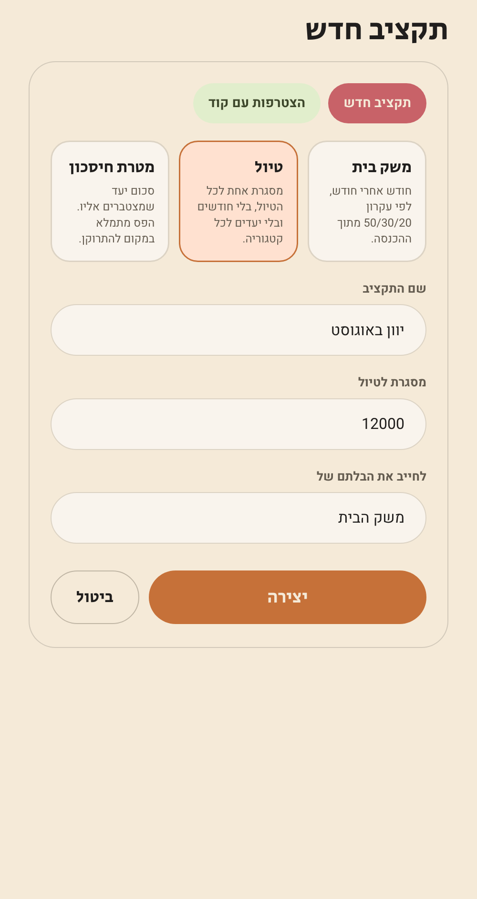
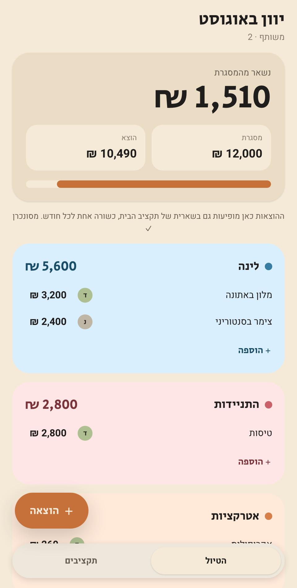
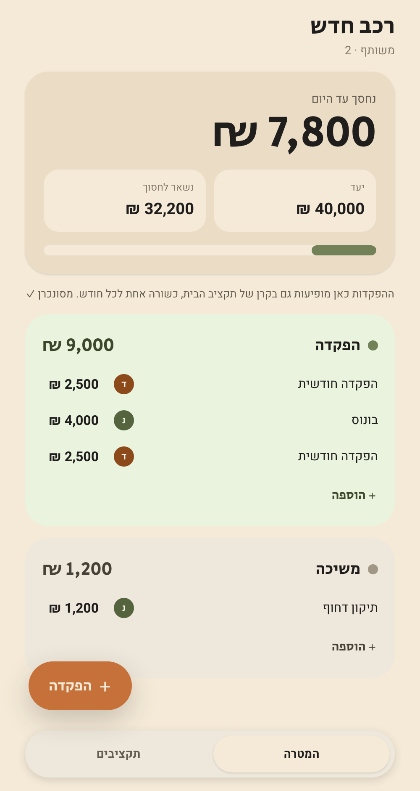

<div align="center">


# BudgetTracker

**A shared budget for two people, built around the 50/30/20 rule.**
An installable PWA. No developer account, no app store, no native build.

[](https://budget-tracker-virid-one.vercel.app)


The interface is in Hebrew and right to left throughout.

</div>

---

## Screens

<table>
<tr>
<td width="33%"></td>
<td width="33%"></td>
<td width="33%"></td>
</tr>
<tr>
<td align="center"><b>Sign in</b><br/>Email and password, or Google</td>
<td align="center"><b>My budgets</b><br/>Personal or shared, with an invite code</td>
<td align="center"><b>New budget</b><br/>Pick a type, and link a trip to a household</td>
</tr>
<tr>
<td></td>
<td></td>
<td></td>
</tr>
<tr>
<td align="center"><b>The month</b><br/>Balance, base amount, targets per group</td>
<td align="center"><b>A trip</b><br/>One frame, its own categories, no months</td>
<td align="center"><b>A saving goal</b><br/>A target to fill, deposits and withdrawals</td>
</tr>
</table>

---

## What it does

| | |
|---|---|
| **One budget, two accounts** | Separate sign ins, shared data. A change shows up on the other phone immediately. |
| **Invite by code** | Eight characters, single use, valid for a week. No editing security rules to add someone. |
| **Several budgets** | A shared household one and a personal one, with different members in each. |
| **Recurring charges** | Tick a box when adding, and the row is created automatically every month. |
| **A real reserve** | The unplanned margin is a category you can spend from, not just a number to look at. |
| **Trips** | A separate budget shape for a trip, which can charge the household reserve. |
| **Saving goals** | A target to accumulate towards, whose deposits count against the household fund. |
| **Works offline** | Opens and shows data without a connection. Writes sync when it returns. |
| **Who entered what** | A coloured avatar on every row. |
| **End of month nudge** | A notification if money is left over, linking straight to a fund deposit. |

---

## Budget types

A budget carries a `type`, chosen when it is created and fixed afterwards, because
every entry under it was written against one shape of screen.

### Household

The monthly budget. Income, a computed base amount, and the three targets. Months
to navigate between, recurring charges, and a history view.

### Trip and saving goal

Both are a different shape rather than a preset of the household one. They share
one amount fixed up front and entries measured against it, and differ in which
direction that amount moves:

|  | Household | Trip | Saving goal |
|---|---|---|---|
| Time | Calendar months | A date on each entry, no month to navigate | Same |
| The amount | Income, base derived from it | A frame to spend down | A target to fill up |
| Categories | Four, fixed in code | Lodging, transport, attractions, dining, shopping, other | Deposit and withdrawal |
| Targets | 50/30/20 of the base | The frame only | The target only |
| Recurring | Yes | Not meaningful | Not meaningful |
| Rolls up into | - | The unplanned reserve | The fund |

Either can be linked to a household budget. The trip or goal keeps every line of
detail; the household gets **one summary row per month**, locked for editing and
pointing back at its source, so the same money is never counted twice or edited in
two places.

Where that row lands follows the meaning: a trip is a one off expense that was
planned for, which is what the unplanned reserve is for, and a goal is exactly
what the 20% fund target exists to hold.

The row id is derived from the source budget and the month, so two devices syncing
at once write to the same document instead of duplicating it. A month that empties
out removes its row, and deleting the budget removes all of them. In a goal, a
withdrawal reduces what is credited for that month rather than adding to it.

---

## The 50/30/20 rule

The ratio is not taken from the whole income but from a **base amount**, so a
liquid margin stays in the account without being allocated to anything.

```
base = floor((income - 1) / 5000) * 5000
```

The base is the nearest multiple of 5,000 strictly **below** the income:

| Income | Base | Reserve |
|---:|---:|---:|
| 24,000 | 20,000 | 4,000 |
| 26,000 | 25,000 | 1,000 |
| 25,000 | 20,000 | 5,000 |

The third row is the one that is easy to get wrong: an income that is an exact
multiple of 5,000 drops a step, which is what the `- 1` is for.

Targets come out of the base: **50%** fixed, **30%** leisure, **20%** fund. The
base is not editable anywhere in the interface; it is always derived.

Overspending in fixed or leisure is marked in red. **Overspending the fund is
not**, because paying in more than the target is the point, and it is shown as
"beyond target" instead.

With no income the month has no base, every target is zero, and a balance would
read as a large deficit that is not real. Those numbers are suspended until an
income exists, and the screen leads with a prompt to enter one.

---

## Data model

```
budgets/{budgetId}               name, ownerUid, type, frame, linkedBudgetId
  members/{uid}                  membership itself; each person creates only their own
  recurring/{recurringId}        a template a monthly row is derived from
users/{uid}/memberships/{id}     private index: which budgets am I in
users/{uid}/devices/{token}      notification registrations, private to that user
invites/{code}                   budgetId, active, expiresAt
entries/{entryId}                budgetId, month, date, category, budgetGroup, amounts
```

Two decisions worth knowing:

**`budgetGroup` is derived from `category`** and never chosen by hand. Income is
`none`, fixed is `fixed`, leisure is `leisure`, fund is `savings`, and the
unplanned reserve is `none` so that it stays outside the ratio.

**`baseAmount` is not stored.** It is recomputed from the month's actual income
every time, so there is no way for it to contradict the data.

---

## Security

Access is enforced in `firestore.rules` in two layers: membership of a budget,
and field by field validation of every record written.

Invites are implemented entirely in rules, with no Cloud Functions, so the project
stays on the free plan. Someone joining creates a membership document **for
themselves only**, and the rule accepts it only against an invite code that is
valid, unused and unexpired.

```bash
npm run test:rules
```

runs 63 tests against a real Firestore emulator, including the adversarial cases:
joining without a code, a used code, an expired code, a code belonging to another
budget, adding somebody else with a valid code, extending an expiry, taking over
ownership, listing invites, moving a record between budgets, and forging
`addedBy`.

---

## End of month nudge

On the last day of the month, if the budget still has unspent money, every member
gets a notification with the amount and a link that opens a fund deposit with that
amount already filled in.

Sending runs from **GitHub Actions**, not a Cloud Function, so the project stays on
the free plan. The job runs daily and decides for itself whether today is the last
day of the month in `Asia/Jerusalem`.

Two one time setup steps:

1. **Web Push key**: Firebase Console → Project settings → Cloud Messaging → Web
   Push certificates → Generate key pair. Add it as `VITE_FIREBASE_VAPID_KEY` in
   `.env.local` and in the Vercel environment variables.
2. **Service account**: Firebase Console → Project settings → Service accounts →
   Generate new private key. Paste the whole JSON as a repository secret named
   `FIREBASE_SERVICE_ACCOUNT`. **That key grants full access to the project. Never
   put it in the code.**

To try it without waiting for the end of the month: GitHub → Actions → run the
workflow with `force` ticked.

On iOS notifications only work in an app that has been added to the Home Screen.
In an ordinary Safari tab the API does not exist at all, and the interface says so
rather than showing a switch that cannot work.

---

## Running locally

```bash
npm install
cp .env.example .env.local   # fill in from the Firebase console
npm run dev
```

Values come from Firebase Console → Project settings → Your apps.

| Script | What it does |
|---|---|
| `npm run dev` | Development server |
| `npm run build` | Production build |
| `npm run preview` | Serve the build, service worker included |
| `npm test` | Logic, rollup and render tests |
| `npm run test:rules` | Security rules against the emulator (needs Java) |
| `npm run lint` | oxlint, with `no-undef` on |
| `npm run deploy:rules` | Push security rules and indexes to Firestore |
| `npm run nudge` | Run the month end sender locally (needs a service account) |

### Testing

Three layers, and each exists because something slipped past the others:

**Logic** covers the base amount, the month summary, recurring templates and the
trip rollup as pure functions.

**Rules** run against a real emulator, since reasoning about Firestore rules by
reading them is unreliable.

**Render** mounts every screen, and the whole tree with a signed in user. A
component that throws while rendering used to pass the entire suite and ship.

---

## Deployment

**Vercel only**, from `main`, automatically on every push:
[budget-tracker-virid-one.vercel.app](https://budget-tracker-virid-one.vercel.app)

The app was once deployed to Firebase Hosting as well. Two live copies where only
one updates by itself is a trap: a fix goes to one address and gets tested on the
other, and it looks like nothing worked. Firebase Hosting has been removed.

What Vercel does **not** cover is Firestore rules and indexes. After changing
`firestore.rules` or `firestore.indexes.json`:

```bash
npm run deploy:rules
```

---

## Installing on iPhone

Open the address in **Safari**, which is the only browser that can install a PWA
on iOS, then Share → Add to Home Screen. It opens full screen with no address bar.

Updates take over as soon as they are deployed. An update that waits for the user
to confirm is a trap: when the running version is broken there is no screen left to
confirm from.

---

## Project layout

```
src/
  components/    the interface
  context/       AuthContext, BudgetContext
  hooks/         entries, history, recurring, trips, balances
  lib/           model, budgets, trips, recurring, members, format, messaging
  sw.js          service worker: caching and background notifications
  index.css      design tokens
  App.css        component styles
scripts/         the month end sender
tests/           logic, rules and render tests
docs/screens/    the screenshots in this file
firestore.rules  security rules
```

The screenshots come from `shots.html`, which is served only by the dev server and
is not part of the build, captured with headless Chrome at 500px wide.
