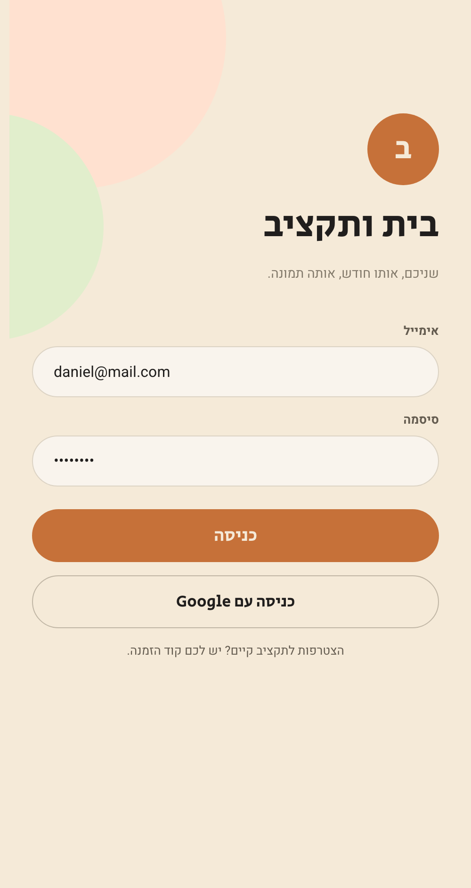
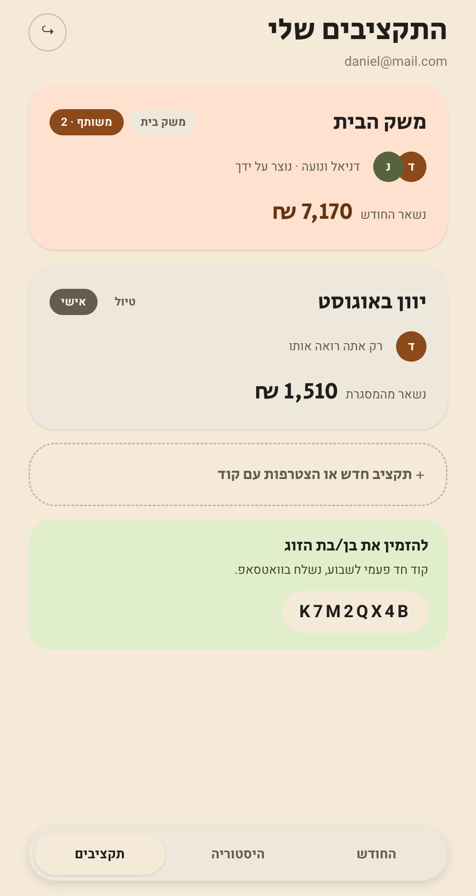
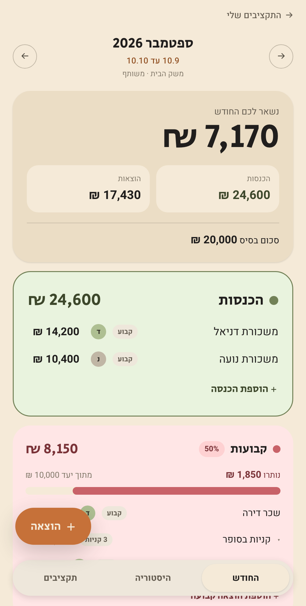
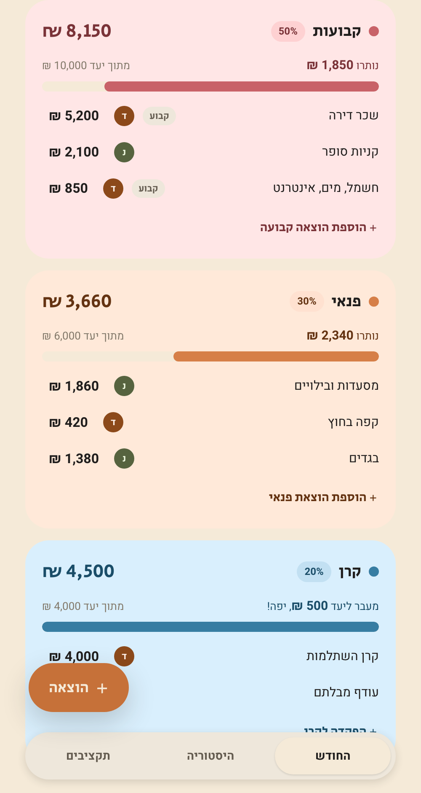
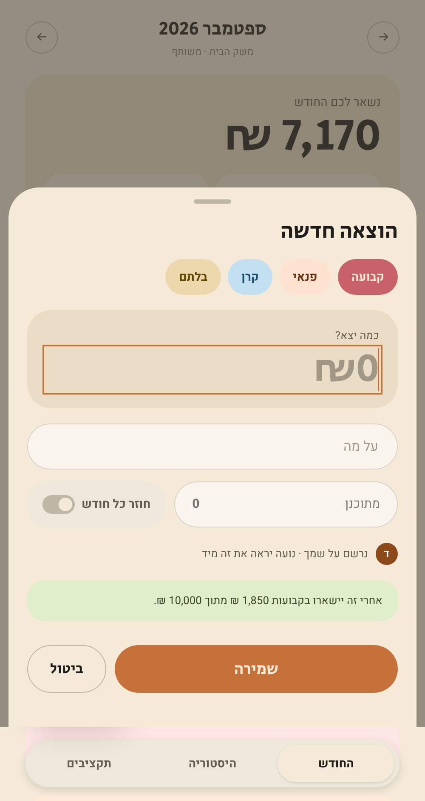
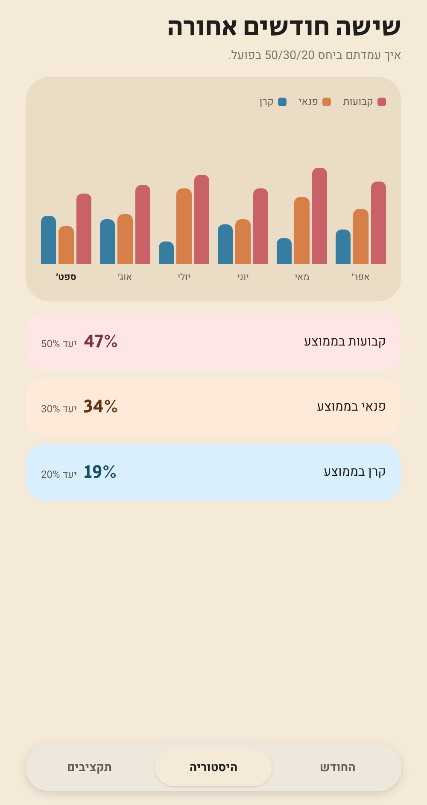

<div align="center">


# בית ותקציב

**מעקב הכנסות והוצאות משותף לזוג, לפי עקרון 50/30/20.**
אפליקציית PWA שמותקנת למסך הבית באייפון, בלי חשבון מפתח ובלי חנות אפליקציות.

[](https://budget-tracker-virid-one.vercel.app)


</div>

---

## המסכים

<table>
<tr>
<td width="33%"></td>
<td width="33%"></td>
<td width="33%"></td>
</tr>
<tr>
<td align="center"><b>התחברות</b><br/>אימייל או Google</td>
<td align="center"><b>התקציבים שלי</b><br/>אישי מול משותף, עם קוד הזמנה</td>
<td align="center"><b>החודש</b><br/>יתרה, סכום בסיס ובלתם</td>
</tr>
<tr>
<td></td>
<td></td>
<td></td>
</tr>
<tr>
<td align="center"><b>קטגוריות</b><br/>יעד, יתרה יורדת ופס התקדמות</td>
<td align="center"><b>הוספה מהירה</b><br/>סכום ראשון, עם תצוגת השפעה</td>
<td align="center"><b>היסטוריה</b><br/>שישה חודשים ועמידה ביעדים</td>
</tr>
</table>

---

## מה זה עושה

| | |
|---|---|
| **תקציב משותף** | שני חשבונות נפרדים, מאגר אחד. כל שינוי מופיע אצל השני מיד, בלי רענון. |
| **הזמנה בקוד** | קוד בן 8 תווים, חד פעמי, בתוקף שבוע. אין צורך לגעת בכללי האבטחה. |
| **כמה תקציבים** | תקציב משותף למשק הבית ותקציב אישי בנפרד, עם חברים שונים בכל אחד. |
| **חיובים קבועים** | סימון בטופס ההוספה, והשורה נוצרת אוטומטית בכל חודש. |
| **בלתם** | המרווח הנזיל שלא חולק לקטגוריות, כרזרבה להוצאות בלתי צפויות. |
| **עובד אופליין** | נפתח ומציג נתונים בלי רשת. כתיבות מסתנכרנות כשהחיבור חוזר. |
| **מי הזין** | אווטאר צבעוני לכל שורה, כדי לדעת מי רשם מה. |
| **תזכורת סוף חודש** | התראה ביום האחרון של החודש אם נשאר כסף, עם קישור שפותח הפקדה לקרן. |

---

## עקרון 50/30/20

היחס לא מחושב מכל ההכנסה אלא מ**סכום בסיס**, כדי שיישאר מרווח נזיל בעו"ש
שלא מוקצה לשום קטגוריה.

```
base = floor((income - 1) / 5000) * 5000
```

הבסיס הוא הכפולה הקרובה של 5,000 שקטנה **ממש** מההכנסה:

| הכנסה בפועל | סכום בסיס | בלתם |
|---:|---:|---:|
| 24,000 ₪ | 20,000 ₪ | 4,000 ₪ |
| 26,000 ₪ | 25,000 ₪ | 1,000 ₪ |
| 25,000 ₪ | 20,000 ₪ | 5,000 ₪ |

השורה השלישית היא המקרה שקל לטעות בו: הכנסה שהיא כפולה מדויקת של 5,000
יורדת מדרגה, ולכן `- 1` בנוסחה.

מתוך הבסיס נגזרים היעדים: **50%** קבועות, **30%** פנאי, **20%** קרן.
הבסיס אינו ניתן לעריכה בשום מקום בממשק, הוא תמיד ערך מחושב.

חריגה בקבועות ובפנאי מסומנת באדום. **חריגה בקרן לא**, כי הפקדה מעל היעד
היא מצב רצוי ומוצגת כ"מעבר ליעד".

---

## טכנולוגיות

- **React 19** + **Vite 8**
- **Firebase**: Firestore לנתונים, Auth להתחברות
- **vite-plugin-pwa** ל-service worker ולמניפסט
- **Vitest** + **@firebase/rules-unit-testing** לבדיקות
- ללא ספריית UI וללא ספריית גרפים. ה-CSS כתוב ידנית מעל טוקנים.

---

## מבנה הנתונים

```
budgets/{budgetId}               name, ownerUid
  members/{uid}                  החברוּת בפועל. כל אחד יוצר רק את עצמו
  recurring/{recurringId}        תבנית של חיוב קבוע
users/{uid}/memberships/{id}     אינדקס פרטי: באילו תקציבים אני חבר
invites/{code}                   budgetId, active, expiresAt
entries/{entryId}                budgetId, month, category, budgetGroup, סכומים
```

שתי החלטות ששווה להכיר:

**`budgetGroup` נגזר מ-`category`** ואינו נבחר ידנית. הכנסות הן `none`,
קבועות הן `fixed`, פנאי הוא `leisure`, וקרן היא `savings`.

**`baseAmount` לא נשמר.** הוא מחושב מחדש בכל פעם מסכום ההכנסות בפועל של
אותו חודש, כך שאין שום דרך שהוא יסתור את הנתונים.

---

## אבטחה

הגישה נאכפת ב-`firestore.rules` בשתי שכבות: חברוּת בתקציב, ומעליה ולידציה
של כל שדה בכל רשומה.

מנגנון ההזמנות מיושם כולו בכללים, בלי Cloud Functions, כדי שיעבוד בתוכנית
החינמית. מוזמן יוצר מסמך חבר של **עצמו בלבד**, והכלל מאשר זאת רק אם הוא
מציג קוד הזמנה תקף שעדיין לא נוצל ולא פג.

`npm run test:rules` מריץ 34 בדיקות מול אמולטור Firestore אמיתי, כולל
תרחישים זדוניים: הצטרפות בלי קוד, קוד שנוצל, קוד שפג, קוד של תקציב אחר,
צירוף של מישהו אחר עם קוד תקף, הארכת תוקף, חטיפת בעלות, סריקת רשימת
ההזמנות, העברת רשומה בין תקציבים וזיוף `addedBy`.

---

## תזכורת סוף חודש

ביום האחרון של החודש, אם נשאר כסף שלא הוצא, כל חבר בתקציב מקבל התראה
עם הסכום וקישור שפותח ישירות הפקדה לקרן עם הסכום ממולא.

השליחה רצה ב-GitHub Actions ולא ב-Cloud Functions, כדי שהכל יישאר
בתוכנית החינמית של Firebase. הסקריפט רץ כל יום ב-16:00 UTC ובודק בעצמו
אם היום הוא האחרון בחודש לפי שעון ישראל.

### מה צריך להגדיר פעם אחת

1. **מפתח Web Push**: Firebase Console ← Project settings ← Cloud Messaging ←
   Web Push certificates ← Generate key pair. להוסיף כ-`VITE_FIREBASE_VAPID_KEY`
   ב-`.env.local` וגם במשתני הסביבה של Vercel.
2. **מפתח שירות**: Firebase Console ← Project settings ← Service accounts ←
   Generate new private key. להדביק את כל תוכן ה-JSON כ-Secret בשם
   `FIREBASE_SERVICE_ACCOUNT` תחת GitHub ← Settings ← Secrets and variables ←
   Actions. **המפתח הזה נותן גישה מלאה לפרויקט. לעולם לא בקוד.**
3. להפעיל את המתג במסך "התקציבים שלי", מתוך האפליקציה המותקנת.

### בדיקה

GitHub ← Actions ← "תזכורת סוף חודש" ← Run workflow, עם `force` מסומן.
כך אפשר לשלוח גם כשזה לא סוף החודש.

באייפון ההתראות עובדות **רק** באפליקציה שהותקנה למסך הבית. בלשונית רגילה
של ספארי ה-API לא קיים בכלל, והממשק יסביר את זה במקום להציג מתג שבור.

---

## הרצה מקומית

```bash
npm install
cp .env.example .env.local   # ולמלא מ-Firebase Console
npm run dev
```

את הערכים לוקחים מ-Firebase Console ← Project settings ← Your apps.

| סקריפט | מה הוא עושה |
|---|---|
| `npm run dev` | שרת פיתוח |
| `npm run build` | בנייה לייצור |
| `npm run preview` | תצוגה מקדימה של הבנייה, כולל service worker |
| `npm test` | בדיקות הלוגיקה |
| `npm run test:rules` | בדיקות כללי האבטחה מול אמולטור (דורש Java) |
| `npm run lint` | oxlint |
| `npm run deploy` | בנייה והעלאה ל-Firebase, כולל כללים ואינדקסים |
| `npm run nudge` | הרצה מקומית של שולח התזכורות (דורש מפתח שירות) |

---

## פריסה

האפליקציה פרוסה בשני מקומות, על אותו מסד נתונים:

- **Vercel** מתוך `main`, אוטומטית בכל push
- **Firebase Hosting** דרך `npm run deploy`

שינויים ב-`firestore.rules` או ב-`firestore.indexes.json` מגיעים **רק** דרך
`npm run deploy`. Vercel לא נוגע בהם.

כל דומיין חדש חייב להתווסף ל-Firebase Console ← Authentication ← Settings ←
Authorized domains, אחרת ההתחברות עם Google נכשלת.

---

## התקנה באייפון

לפתוח את הכתובת ב**ספארי** (רק הוא תומך בהתקנה ב-iOS), כפתור השיתוף,
ואז **הוספה למסך הבית**. האפליקציה תיפתח במסך מלא, בלי שורת כתובת.

---

## מבנה התיקיות

```
src/
  components/    רכיבי הממשק
  context/       AuthContext, BudgetContext
  hooks/         useEntries, useHistory, useRecurring, useBudgetBalance
  lib/           model, budgets, recurring, members, format, firebase
  sw.js          service worker: מטמון והתראות ברקע
  index.css      טוקני העיצוב
  App.css        סגנונות הרכיבים
scripts/         שולח תזכורות סוף החודש
tests/           בדיקות לוגיקה וכללי אבטחה
docs/screens/    צילומי המסך שב-README
firestore.rules  כללי האבטחה
```

צילומי המסך נוצרים מ-`shots.html` (זמין רק בשרת הפיתוח, לא נכנס לבנייה)
עם Chrome headless ברוחב 500px.
